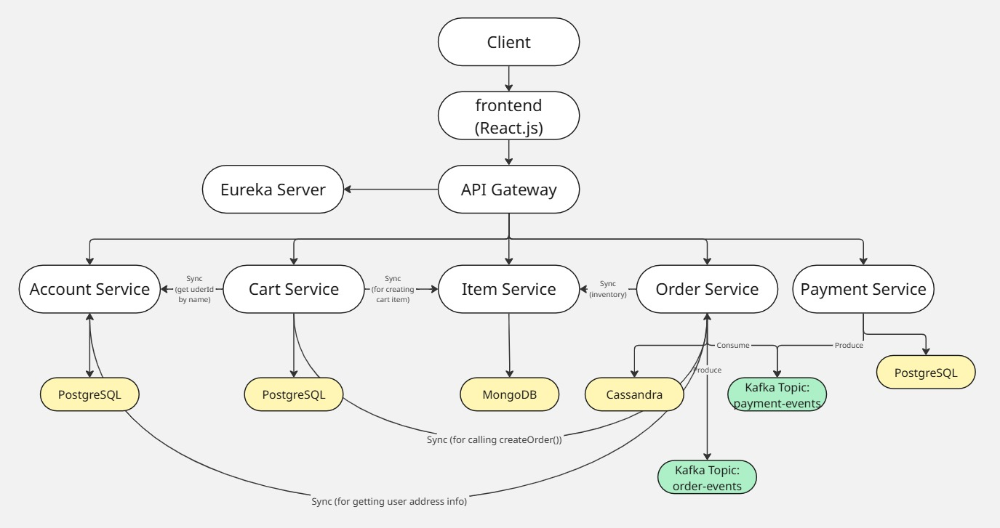
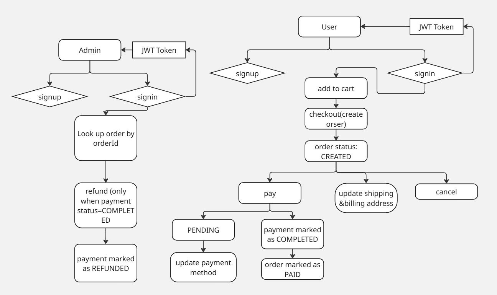
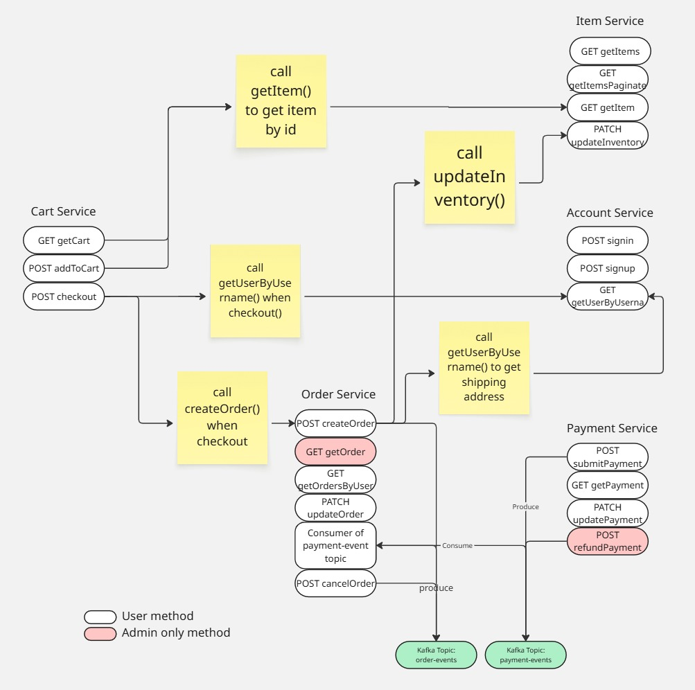
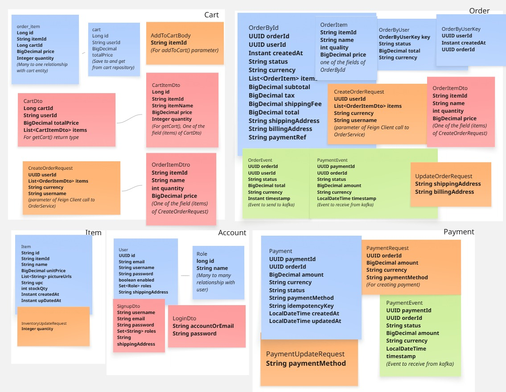
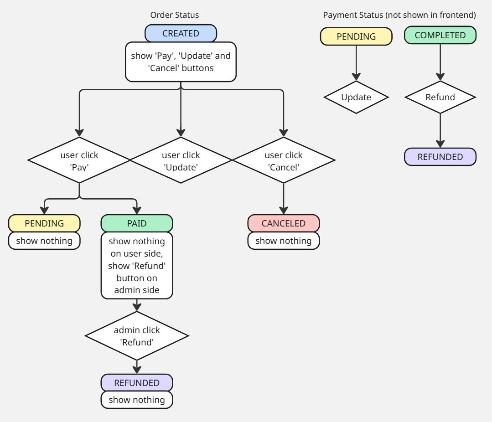

# RUN
## 1. Start database and kafka container
in root folder:
```
docker compose -f docker-compose.yml up -d
```
## 2. Start backend servers
```
mvn clean install -f        common-security/pom.xml -q && mvn clean compile -f        ItemService/pom.xml -q && mvn clean compile -f CartService/pom.xml -q && mvn clean compile -f OrderService/pom.xml -q && mvn clean compile -f PaymentService/pom.xml -q && mvn clean compile -f AccountService/pom.xml
```
in each service's root folder:
```
./mvnw spring-boot:run
```
## 3. Start frontend
in shop-net folder under root folder:
```
npm start
```
The application is available on http://localhost:3000/


# Functional Requirements
- User signin/signup (Account Service)
- Add items to cart (Item Service, Cart Service:)
- Clear cart (Cart Service)
- Inventory update (Item Service)
- Order CRUD (Order Service)
- Payment CRUD (Payment Service)

**Architecture diagram**


**User Flow**



**Data Flow**



**Data Models**



**Status code:**



# API design
## Account Service

### 1. Signup
- this will save a user to users and user_roles table.
#### POST http://localhost:8090/api/v1/auth/jwt/signup
Request body:
```
{
  "username": "admin",
  "email": "admin@gmail.com",
  "password": "123",
  "shippingAddress": "123 Main Rd.",
  "role": [
    "ROLE_ADMIN"
  ]
}
```

### 2. Signin
- This will return a JWT token.
#### POST http://localhost:8090/api/v1/auth/jwt/signin
Request body:
```
{
  "accountOrEmail": "admin",
  "password": "123"
}
```

### 3. getUserByUsername
- this is for other services to get user info by username
#### GET  http://localhost:9090/api/v1/auth/jwt/user?username={username}


## Item Service

### 1. getAllItems
#### GET  http://localhost:8092/api/items

### 2. get all items (paginated)

#### GET  http://localhost:8092/api/items/paginated?page=0&size=8

### 3. get item by itemId

#### GET  http://localhost:8092/api/items/{itemId}

example: http://localhost:8092/api/items/ITEM-001

### 4. update inventory when checking out

#### PATCH  http://localhost:8092/api/items/{itemId}/inventory
Example: http://localhost:8092/api/items/ITEM-001/inventory
Request body:

```
{
    "quantity":4
}
```
## Cart Service
### 1. getCart
#### http://localhost:8094/api/cart?username=...

### 2. addToCart
#### POST http://localhost:8094/api/cart?username=...
Request body:
```
{itemId: "ITEM-001"}
```

### 3. checkout
- This will clear cart, and call Order Service to create order (inventory update) synchronously.
#### POST http://localhost:8094/api/cart/checkout

## Order Service
### 1. createOrder
- This will save an order to Cassandra database and publish an event on order-event topic in kafka.
#### POST http://localhost:8091/api/orders
Request body:
```
{
  "userId": "2b1bc6c0-0d27-41bc-b8ac-db8bbe5ee01b",
  "items": [
    {
      "itemId": "ITEM-001",
      "name": "Chicken Fries - 9 Pc",
      "quantity": 1,
      "price": 4.89
    }
  ],
  "currency": "USD",
  "username": "user"
}
```
### 2. get Order by orderId
-  only for requests from 'ADMIN', 'SERVICE'
#### GET http://localhost:8091/api/orders/{orderId}

### 3. getOrdersByUser
#### GET http://localhost:8091/api/orders?userId=...

### 4. update an order (not included in frontend)
#### PATCH http://localhost:8091/api/orders/{orderId}
Request body:
```
{
    "shippingAddress": "123 Foothill Rd",
    "billingAddress:" "456 Third Ave"
}
```
### 5. cancelOrder (not included in frontend)
#### POST http://localhost:8091/api/orders/{orderId}/cancel

## Payment Service
### 1. submitPayment
- Use idempotency-key in header
- Publish an event on payment-event kafka topic, the Order Service is consuming this topic and mark orders as PENDING or PAID.
#### POST http://localhost:8091/api/payments
Request body:
```
{
    "orderId":"b39875c8-a105-48f3-bd5e-689af06d2f73",
    "amount": 29.92,
    "currency": "USD",
    "paymentMethod": "credit_card"
}
```
### 2. getPayment (not included in frontend)
#### GET http://localhost:8091/api/payments/{paymentId}

### 3. updatePayment (not included in frontend)
#### PATCH http://localhost:8091/api/payments/{paymentId}
Request body:
```
{
    "paymentMethod": "paypal"
}
```

### 4. refundPayment (not included in frontend)
#### POST http://localhost:8091/api/payments/{paymentId}/refund
